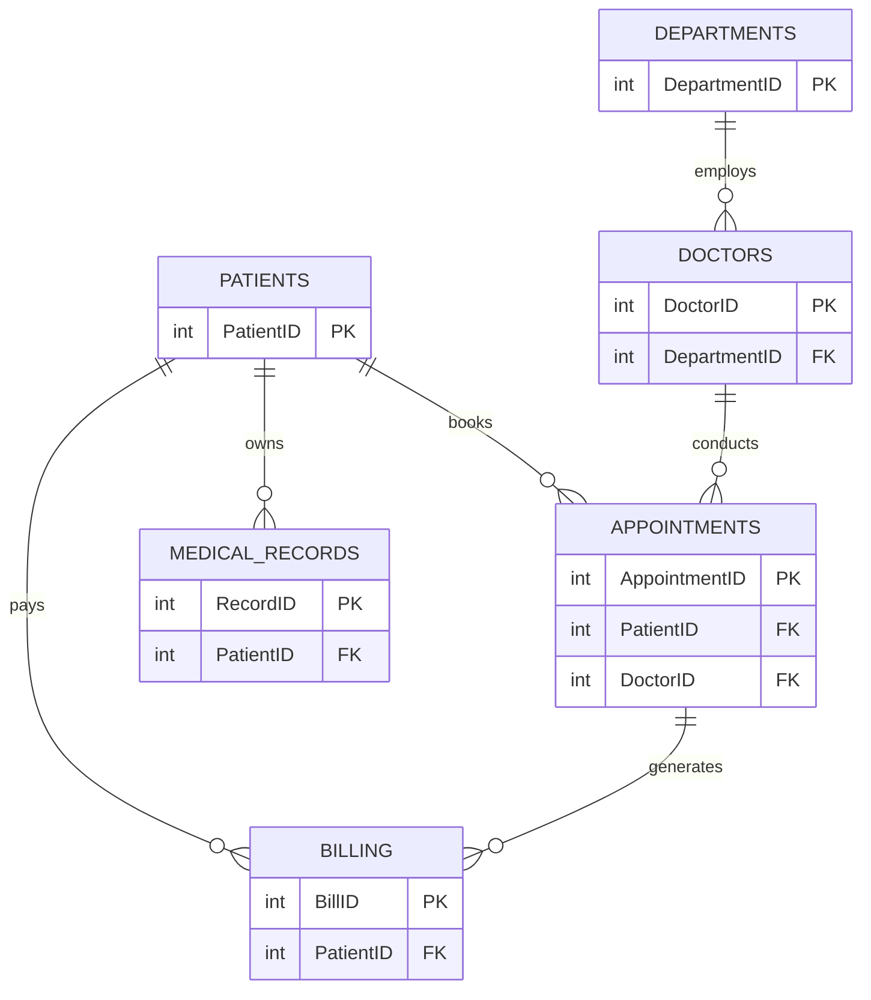
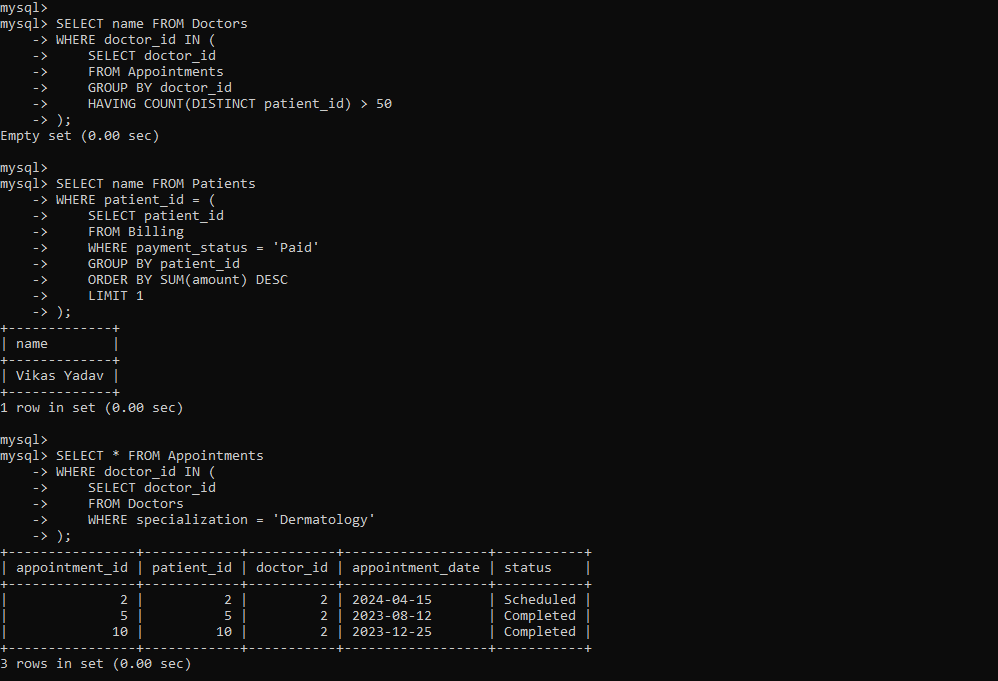
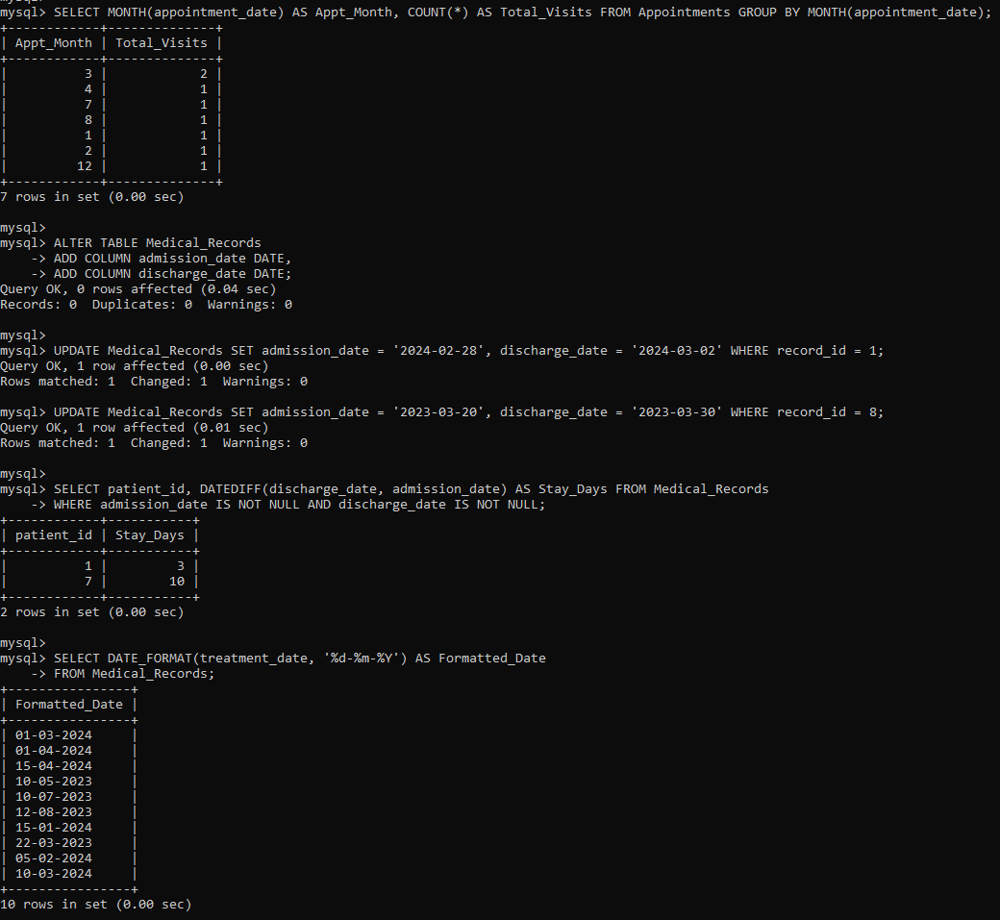
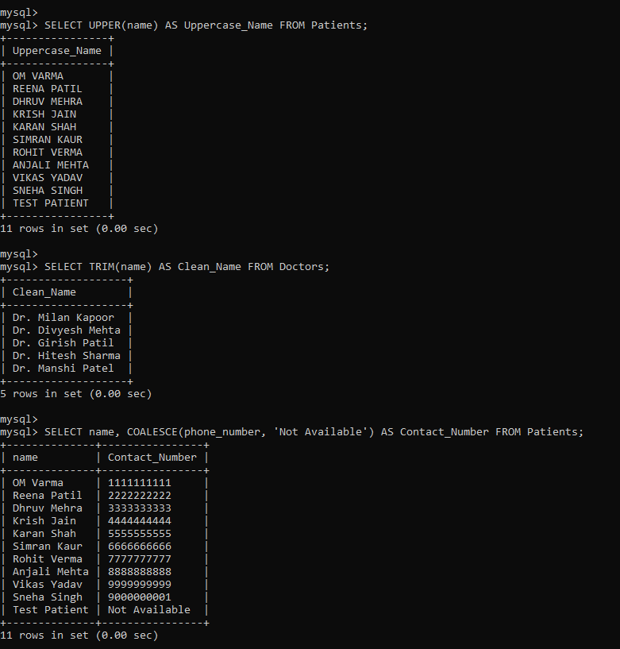
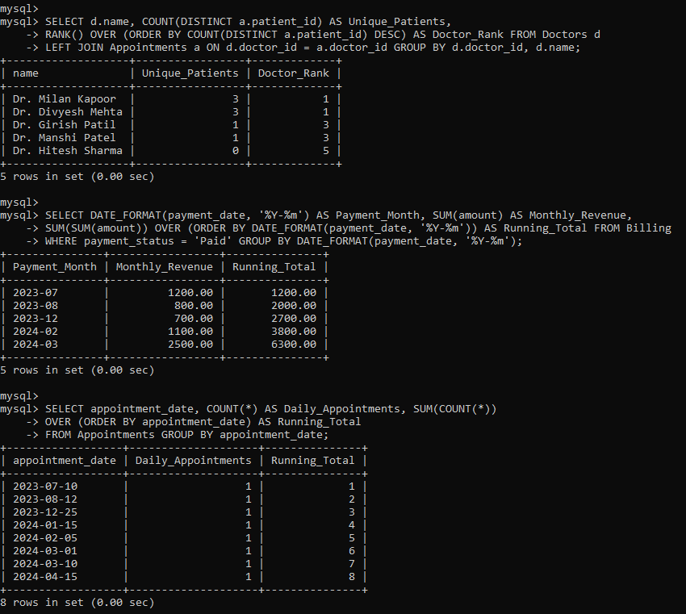
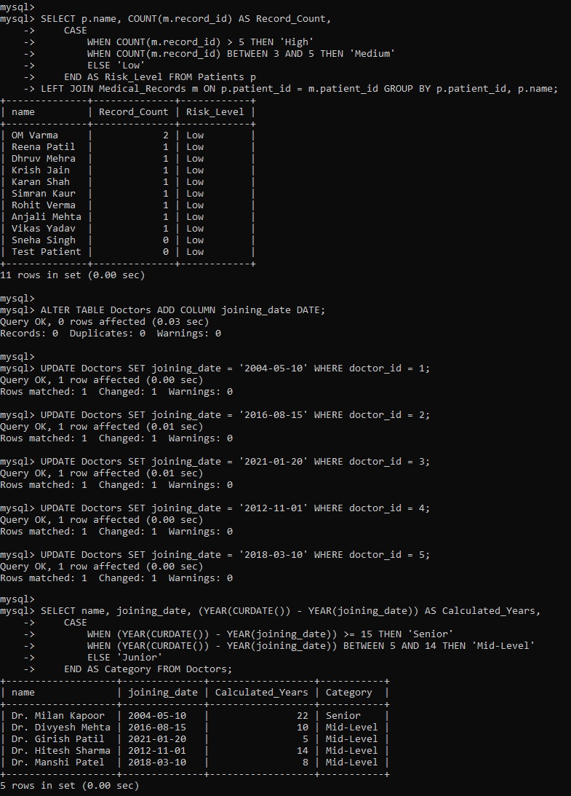

# 🏥 Hospital Management System (MySQL)

<p align="center">
  <b>A production-style relational database system designed to manage hospital operations including patients, doctors, appointments, billing, and medical records using advanced SQL.</b>
</p>

<p align="center">
  
  
  
</p>

---

## 📌 Table of Contents
1. [Overview](#overview)
2. [Features & Design](#features-design)
3. [System Architecture & ERD](#architecture)
4. [SQL Capabilities Demonstrated](#sql-capabilities)
5. [Visual Tour (Screenshots)](#visual-tour)
6. [Project Structure](#project-structure)
7. [Getting Started / Setup](#getting-started)
8. [Future Improvements](#future-improvements)
9. [Author](#author)

---

<a id="overview"></a>
## 📖 Overview

This project simulates a fully functional **Hospital Management System** at the database layer. It is designed to handle the complex, interconnected data of a medical facility, where:
- **Patients** register and maintain their personal records.
- **Doctors** manage their appointments and department specializations.
- **Appointments** track patient visits, schedules, and statuses.
- **Billing** securely manages payments tied to specific visits.
- **Medical Records** store comprehensive treatment history for patients.

---

<a id="features-design"></a>
## ✨ Features & Database Design

### 🎯 Key Features
- **Full CRUD Operations:** Seamless creation, retrieval, updating, and deletion of records.
- **Real-World Relational Schema:** Built to mimic actual production environments.
- **Advanced Analytical SQL:** Utilizing Window Functions, Subqueries, and Complex Joins.
- **Data Analysis:** Generates actionable reports and aggregations.

### 🧠 Core Tables
- `Patients`
- `Doctors`
- `Departments`
- `Appointments`
- `Billing`
- `Medical_Records`
- `Doctor_Department` _(Junction table for many-to-many relationships)_

---

<a id="architecture"></a>
## 🏗️ System Architecture & ERD

Below is the Entity-Relationship Diagram representing the logical flow of the hospital operations, demonstrating how patients, doctors, and their respective records interact.



---

<a id="sql-capabilities"></a>
## 💡 SQL Capabilities Demonstrated

This project highlights deep backend data logic skills, analytical thinking, and strict database normalization through:

- **Joins:** `INNER JOIN`, `LEFT JOIN`, `RIGHT JOIN`
- **Subqueries:** Nested logic for complex filtering
- **Aggregations:** `GROUP BY` combined with `HAVING`
- **Window Functions:** `RANK()`, `SUM() OVER()`
- **Conditional Logic:** `CASE` Statements for dynamic outputs
- **Date Functions:** `YEAR()`, `MONTH()`, `DATEDIFF()`
- **String Functions:** `UPPER()`, `TRIM()`, `COALESCE()`

---

<a id="visual-tour"></a>
## 📸 Visual Tour (Screenshots)

### 🗄️ Basic Operations (Insert, Update, Delete)
_Demonstrating the fundamental manipulation of database records._
<p align="center"> 
   
   
</p>

### 🔍 Filtering & Aggregations
_Extracting specific data subsets and grouping information._
<p align="center"> 
   
   
</p>

### 📊 Query Results & Conditions
_Applying specific rules and conditions to extract meaningful insights._
<p align="center"> 
   
   
</p>

### 🔗 Joins & Relationships
_Stitching relational data back together to form comprehensive views._
<p align="center"> 
   
   
</p>

### 📈 Advanced Queries
_Executing complex, multi-layered SQL statements._
<p align="center"> 
   
   
</p>

### 🧾 Window Functions & Analysis
_Performing advanced analytical calculations over data partitions._
<p align="center"> 
   
</p>

---

<a id="project-structure"></a>
## 📁 Project Structure

```text
project-root/
│
├── README.md                           # Project documentation
├── Hospital_managment_system.sql       # Complete database schema and queries
└── screenshots/                        # Output captures of executed queries
    ├── sc1(5).png
    ├── sc2(5).png
    ├── sc3(6).png
    ├── sc4(2).png
    ├── sc5(2).png
    ├── sc6(1).png
    ├── sc7.png
    ├── sc8.png
    ├── sc9.png
    ├── sc10.png
    └── sc11.png
```

---

<a id="getting-started"></a>
## ⚙️ Getting Started / Setup

1. **Clone the repository:**
   ```bash
   git clone [https://github.com/yourusername/hospital-management-system.git](https://github.com/yourusername/hospital-management-system.git)
   cd hospital-management-system
   ```

2. **Open your MySQL environment:**
   Launch MySQL Workbench or your preferred MySQL Command Line Client.

3. **Run the SQL file:**
   Execute the script to build the database, populate the tables, and run the queries:
   ```sql
   SOURCE Hospital_managment_system.sql;
   ```

---

<a id="future-improvements"></a>
## 🚀 Future Improvements

To further bridge the gap between this database model and a full-stack application, planned improvements include:
- Implementing **Stored Procedures** for routine operations.
- Adding **Triggers** for automated audit logging.
- Developing a **Frontend Dashboard**.
- Building an **API Integration** layer.
- Integrating a secure **Authentication System**.

---

<a id="author"></a>
## 👤 Author

**Dushyant** _SQL | Data | Backend Systems_

⭐ **If you like this project, please give it a ⭐ on GitHub!**